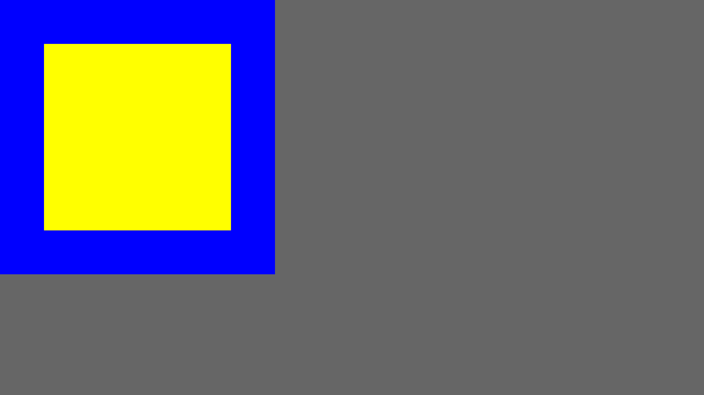
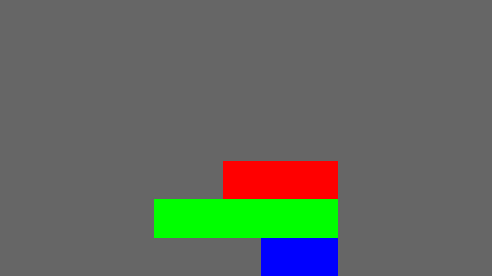
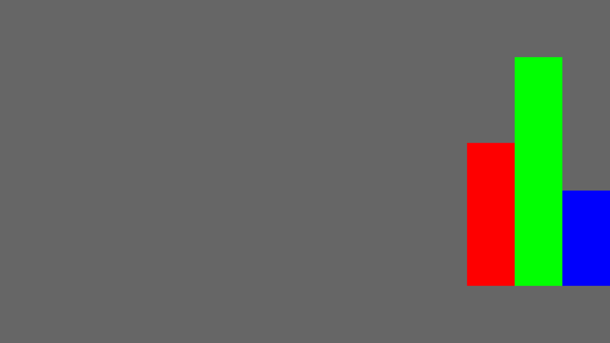
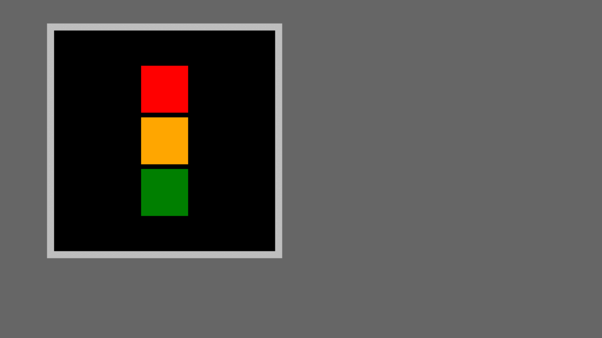

# Wings UI
A new way to build User Interfaces on top of BevyUI.
This design is inspired from Flutter.

### Built-in Widgets
1. Scaffold
2. Container
3. SizedBox
4. Align
5. Center
6. Button
7. Column
8. Row
9. ConstrainedWidth
10. ConstrainedHeight
11. HorizontalDivider
12. VerticalDivider
13. Visibility
14. LayoutVisibility
15. Padding
16. Text

### Built-in Queries

1. Color <i>(background_color)</i>
2. Size <i>(width + height)</i>
3. Visibility
4. LayoutVisibility
5. Text <i>(text, font_size, color)</i>

### Known limitations / Work in progress
1. Currently, you cannot create your own widgets
2. For/If statements inside widget tree are missing
3. Missing a lot of useful widgets such as ProgressIndicator, CheckBox, RadioButton, ToggleButton, Dropdown, TextEdit, SelectableText, ScrollArea, ListView, AppBar, Icon, Stack, Grid, Wrap and so on..
4. Animations capability
5. Alignment values have issues. Consider adding a system to process them
6. Events are not implemented properly, consider adding GestureDetector and Focus widgets

#### <u>Padding Example</u>

<p>
  
</p>

```rust
widget_tree!(
    Scaffold {
        child: Container {
            color: Some(Color::BLUE)
            width: val![500. px]
            height: val![500. px]
            child: Padding {
                padding: EdgeInsets::all(val![80. px])
                child: Container {
                    color: Some(Color::YELLOW)
                    width: val![100. %]
                    height: val![100. %]
                }
            }
        }
    }
);
```

#### <u>Column Example</u>

<p>
  
</p>

```rust
widget_tree!(
    Scaffold {
        child: Center {
            child: Column {
                main_axis_size: MainAxisSize::Max
                main_axis_alignment: MainAxisAlignment::End
                cross_axis_alignment: CrossAxisAlignment::End
                children: [
                    Container {
                        color: Some(Color::RED)
                        width: val![300. px]
                    }
                    Container {
                        color: Some(Color::GREEN)
                        width: val![480. px]
                    }
                    Container {
                        color: Some(Color::BLUE)
                        width: val![200. px]
                    }
                ]
            }
        }
    }
);
```

#### <u>Row Example</u>

<p>
  
</p>

```rust
widget_tree!(
    Scaffold {
        child: Center {
            child: Row {
                main_axis_size: MainAxisSize::Max
                main_axis_alignment: MainAxisAlignment::End
                cross_axis_alignment: CrossAxisAlignment::End
                children: [
                    Container {
                        color: Some(Color::RED)
                        height: val![300. px]
                    }
                    Container {
                        color: Some(Color::GREEN)
                        height: val![480. px]
                    }
                    Container {
                        color: Some(Color::BLUE)
                        height: val![200. px]
                    }
                ]
            }
        }
    }
);
```

#### <u>Queries Example</u>

<p>
  
</p>

```rust
use bevy::prelude::*;
use wings::prelude::*;

fn main() {
    App::new()
        .add_plugins(DefaultPlugins)
        .add_plugins(WingsPlugin)
        .add_systems(Startup, startup)
        .add_systems(Update, change_color)
        .run();
}

#[derive(Component, Debug)]
pub struct ColorTag;

fn startup(mut commands: Commands) {
    commands.spawn(Camera2dBundle::default());

    widget_tree! {
        Scaffold {
            child: Container {
                decoration: Some(BoxDecoration {
                    color: Color::BLACK,
                    border: Border::all(BorderSide::from_width_color(val![15. px], Color::SILVER)),
                    ..default()
                })
                width: val![500. px]
                height: val![500. px]
                margin: edge_insets_only! {
                    left: val![100. px],
                    top: val![50. px],
                }
                child: Center {
                    child: Column {
                        children: [
                            Container { color: Some(Color::RED) }
                            SizedBox { height: val![10. px] }
                            Visibility {
                                tags: [Collapsible]
                                child: Column {
                                    children: [
                                        Container {
                                            tags: [ColorTag]
                                            color: Some(Color::ORANGE)
                                        }
                                        SizedBox { height: val![10. px] }
                                    ]
                                }
                            }
                            Container { color: Some(Color::DARK_GREEN) }
                        ]
                    }
                }
            }
        }
    }
}

fn change_color(
    keyboard_input: Res<Input<KeyCode>>,
    mut color_query: UiColorQuery<ColorTag>,
    mut visibility_query: UiVisibilityQuery<Collapsible>,
) {
    if keyboard_input.just_pressed(KeyCode::Space) {
        color_query.set_random_color();
    }

    if keyboard_input.just_pressed(KeyCode::Z) {
        visibility_query.set_visible(false);
    } else if keyboard_input.just_pressed(KeyCode::X) {
        visibility_query.set_visible(true);
    }
}
```

### Some queries tips:

! When working with WingsUI, Do not access BevyUI components directly because of unexpected behaviour !
Instead use built-in Queries !

```rust
// This is bad use
fn update_color_bad(mut query: Query<(&mut BackgroundColor, With<UiContainer>)>) {
    for (mut bg_color, _) in query.iter_mut() {
        bg_color.0 = get_random_color_with_alpha();
    }
}

// You can do this if you want more control over entities, but still not recommended
fn update_color_also_bad(mut query: UiColorQuery<UiContainer>) {
    query.get_mut().for_each_mut(|(_, mut c_color, _)| {
        c_color.0 = get_random_color_with_alpha();
    });
}

// This is the most ergonomic way
fn update_color_good(mut query: UiColorQuery<UiContainer>) {
    query.set_random_color_with_alpha();
}
```